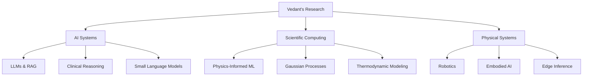

<div align="center">
  
</div>

<div align="center">
  
  [](https://linkedin.com/in/vedantjadhav-ai)
  [](https://github.com/VedantJadhav701)
  [](mailto:vedantjadhav1414@gmail.com)
  [](https://vedantjadhav701.github.io)
  
</div>

---

<div align="center">
  
</div>

## 🎯 About Me

```python
class VedantJadhav:
    def __init__(self):
        self.education = "B.Tech. Computer Science (AI & ML)"
        self.university = "Pimpri Chinchwad University, Pune"
        self.cgpa = 7.63
        self.location = "Pune, Maharashtra, India"
        
    def expertise(self):
        return {
            "research": ["LLMs", "Scientific ML", "Physical Intelligence"],
            "production": ["MLOps", "RAG Systems", "Edge Inference"],
            "domains": ["Materials Science", "Medical AI", "Renewable Energy", "Robotics"]
        }
    
    def current_focus(self):
        return [
            "Physics-Informed ML & Embodied AI",
            "Production ML Systems & Infrastructure",
            "Clinical Reasoning & Medical AI Alignment",
            "Recursive Language Models for Long-Context Reasoning"
        ]
```

---

<div align="center">
  
</div>

## 🏆 Achievements & Recognition

<table>
<tr>
<td align="center" width="50%">

### 🥇 Awards
- **Best Research Paper Award** – ICCTVB-25 (Scopus Indexed)
- **1st Place** – Code4Society Hackathon 2026
- **1st Place** – CodeApex 24-hour Hackathon, VIT
- **3rd Place** – National DevCraft Hackathon, IIT Indore
- **3rd Place** – National AI Hackathon, IIT Indore
- **National Finalist** – Table Tennis, IIM Indore

</td>
<td align="center" width="50%">

### 📚 Publications
- **AIP Publishing** – Renewable Energy Forecasting
- **Under Review** – Clinical Reasoning & SLMs
- **Working Paper** – Physics-Informed ML for Metallurgy
- **Applied Research** – Magnesium Extraction & Biomass

</td>
</tr>
</table>

---

<div align="center">
  
</div>

## 📚 Research & Publications

### 🔬 Published Work
<div align="left">

**"Ensemble and Hybrid ML Approaches for Renewable Energy Forecasting"**
- 📰 **Venue**: AIP Publishing (2025)
- 🏆 **Best Research Paper Award** at ICCTVB-25
- 📊 **Results**: 30% error reduction (synthetic), 15% (real-world)
- 🔗 **Indexed**: Scopus

</div>

### 📖 Working Papers
<div align="left">

**"Physics-Informed Gaussian Process Modeling for Carnallite Electrolysis Optimization"**
- 🔬 **Innovation**: Derived Eutectic Lower Bound Theorem (423°C)
- 📈 **Performance**: R² = 0.9996 (synthetic), R² = 0.880 (cross-source)
- 🎯 **Pathways**: Two optimal routes identified (KCl-MgCl₂, MgCl₂-NaCl)

**"Small Language Models for Clinical Reasoning and Medical Decision Alignment"** (Under Review)
- 🆕 **Metrics**: Semantic Drift Score (SDS), Structural Alignment Index (SAI)
- 💡 **Key Finding**: Accuracy ≠ Deployment Readiness

</div>

### 🧪 Applied Research
<div align="left">

- **Magnesium Extraction** via Physics-Informed ML (R² = 0.987, 250°C reduction)
- **Levulinic Acid Yield Prediction** using GPR (R² = 0.966, 10-model benchmark)

</div>

---

<div align="center">
  
</div>

## 💼 Professional Experience

### 🚀 DPulseAI Pvt. Ltd. | AI Developer Intern
**October 2025 - April 2026 | Pune, Maharashtra**

<table>
<tr>
<td width="5%">📌</td>
<td>Engineered production LLM and RAG systems achieving <b>35% retrieval accuracy</b> improvement and <b>45% latency reduction</b></td>
</tr>
<tr>
<td>📌</td>
<td>Architected Dockerized inference pipelines with CI/CD and canary deployments, reducing deployment time to <b>under 10 minutes</b></td>
</tr>
<tr>
<td>📌</td>
<td>Designed scalable inference services with cost optimization through quantization and post-deployment monitoring</td>
</tr>
</table>

### 🎨 Tamizhan Skills | AI & ML Intern
**April 2025 - May 2025 | Pune, Maharashtra**

<table>
<tr>
<td width="5%">📌</td>
<td>Delivered 5+ NLP applications using AWS Lambda and Streamlit, reducing manual processing time by <b>30%</b></td>
</tr>
<tr>
<td>📌</td>
<td>Automated text summarization and classification workflows, increasing operational throughput by <b>25%</b></td>
</tr>
</table>

---

<div align="center">
  
</div>

## 🚀 Flagship Projects

### 🌍 EcoGuard – AI Carbon Intelligence Platform
<div align="left">

**Code4Society Hackathon 2026 - Winner**

| Aspect | Details |
|--------|---------|
| 🎯 **Objective** | Multimodal AI system for carbon footprint intelligence |
| 🔧 **Tech Stack** | React, FastAPI, Edge ML, IoT Sensors, Computer Vision |
| 🎁 **Deliverables** | Carbon score breakdown, real-time tracking, what-if simulation |
| 🏆 **Recognition** | Hackathon Winner (1st Place) |

</div>

### 🤖 Vision System – Autonomous Cleaning Robot
<div align="left">

**Physical AI & Edge Inference (2025)**

| Metric | Value |
|--------|-------|
| 🎯 **Model** | YOLOv8 Nano (Custom Dataset) |
| 📊 **Precision** | 0.782 |
| 🎯 **Recall** | 0.795 |
| 🎪 **mAP@50** | 0.823 |
| ⚡ **Latency** | ~6 ms/image (~166 FPS on GPU) |
| 🎓 **Application** | Real-world robotics debris detection |

</div>

### 🏥 ILM – Institutional Language Model
<div align="left">

**Healthcare SLM + RAG Platform (2025)**

| Component | Achievement |
|-----------|-------------|
| 🏗️ **Architecture** | On-premise hospital intelligence engine |
| 🔍 **Retrieval** | Vector-search with RAG integration |
| 📈 **Accuracy Gain** | 32% improvement across departments |
| 🔐 **Security** | Role-based access control |
| 📊 **Monitoring** | Drift detection & post-deployment tracking |

</div>

### 🦾 Robotics Action Prediction System
<div align="left">

**Production ML + MLOps (2025)**

- Built **LSTM-based sequence model** for robotic action prediction
- Implemented robust preprocessing and validation pipelines
- Deployed production-grade inference using **FastAPI + Docker**
- Integrated feature masking, normalization, and stability safeguards

</div>

### 🧠 LLM Reasoning Evaluation Pipeline
<div align="left">

**NVIDIA Nemotron (2025)**

- Developed scalable evaluation pipeline for **reasoning-focused LLMs**
- Implemented multi-hop benchmarks and advanced prompting techniques
- Deployed FastAPI-based inference with **MLflow tracking**
- Automated CI/CD benchmarking for accuracy and latency metrics

</div>

---

<div align="center">
  
</div>

## 🛠️ Technical Arsenal

<div align="center">

### 💻 Programming Languages
<div>
  
  
  
  
</div>

### 🤖 AI & Machine Learning
<div>
  
  
  
  
</div>

### 🚀 ML Frameworks & Tools
<div>
  
  
  
  
</div>

### ☁️ Cloud & Infrastructure
<div>
  
  
  
  
</div>

### 💾 Databases & Vector Stores
<div>
  
  
  
  
</div>

### 🔬 Specialized Skills
<div>
  
  
  
  
  
  
</div>

</div>

---

<div align="center">
  
</div>

## 📊 GitHub Analytics

<div align="center">


</div>

<div align="center">


</div>

---

<div align="center">
  
</div>

## 🎓 Education & Certifications

<div align="center">

| Degree | Institute | Score | Year |
|--------|-----------|-------|------|
| **B.Tech. (AI & ML)** | Pimpri Chinchwad University, Pune | 7.63 CGPA | 2023-27 |
| **Senior Secondary (HSC)** | HSC Board | 65% | 2023 |
| **Secondary (SSC)** | SSC Board | 82% | 2021 |

### 🏅 Professional Certifications
- **Deep Learning Specialization** – DeepLearning.AI
- **TensorFlow for AI/ML** – DeepLearning.AI
- **Supervised ML Specialization** – Stanford University
- **Mathematics for ML & Data Science** – DeepLearning.AI (Linear Algebra, Calculus, Probability & Statistics)

</div>

---

<div align="center">
  
</div>

## 🎯 Leadership & Community Impact

<table align="center">
<tr>
<td align="center" width="50%">

### 🏢 Organizational Roles
- **Core Coordinator** – PCU Sports Club (2023-27)
- **Placement Coordinator** – Career Dev Cell (2024-27)
- **Core Team Member** – R&D Club (2023-27)
- **Team Leader** – Smart India Hackathon 2025

</td>
<td align="center" width="50%">

### 🎤 Additional Contributions
- **Technical Speaker** – 3+ talks on AI deployment & production ML
- **Hackathon Mentor** – Multiple hackathon events
- **Research Collaborator** – Multiple ML/materials science projects

</td>
</tr>
</table>

---

<div align="center">
  
</div>

## 🔬 Research Domains & Interests



---

<div align="center">
  
</div>

## 💡 Current Focus

<div align="center">

<table>
<tr>
<td>

🧠 **Physical Intelligence & Embodied AI**
- Interaction-driven learning
- Embodied constraints in AI systems

</td>
<td>

📈 **Production ML Systems**
- MLOps best practices
- Inference optimization & monitoring

</td>
</tr>
<tr>
<td>

🏥 **Medical AI Alignment**
- Clinical decision support
- Reasoning evaluation frameworks

</td>
<td>

🔄 **Recursive Language Models**
- Long-context inference-time scaling
- Reasoning performance optimization

</td>
</tr>
</table>

</div>

---

<div align="center">
  
</div>

## 📬 Get In Touch

<div align="center">

### Let's Connect!

<table>
<tr>
<td align="center" width="33%">

**📧 Email**

[vedantjadhav1414@gmail.com](mailto:vedantjadhav1414@gmail.com)

</td>
<td align="center" width="33%">

**💼 LinkedIn**

[vedantjadhav-ai](https://linkedin.com/in/vedantjadhav-ai)

</td>
<td align="center" width="33%">

**📱 Phone**

+91-7410036328

</td>
</tr>
</table>

---

### I'm always open to:
- 🤝 Research collaborations
- 💬 Discussing AI/ML systems
- 🚀 Building production ML pipelines
- 📚 Knowledge sharing and mentoring

</div>

---

<div align="center">

### ⚡ Fun Fact


</div>

---

<div align="center">
  
</div>

<div align="center">

### 🎨 Design & Stats


**Built with ❤️ | Last Updated: April 2026**


</div>
