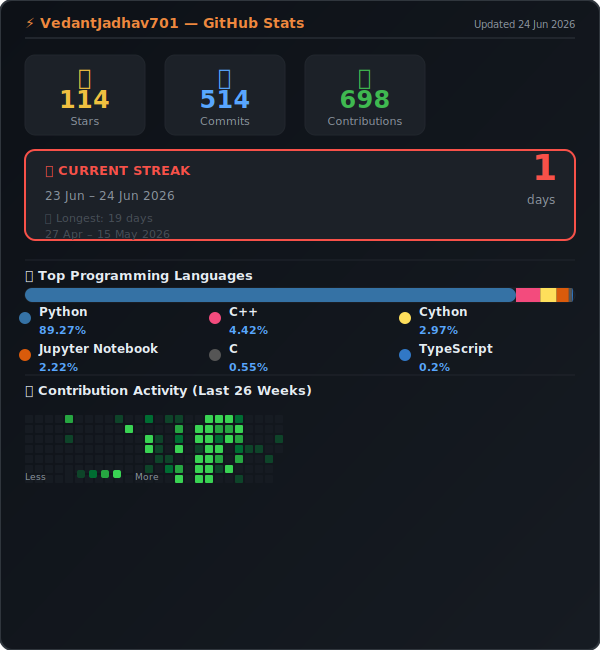

<div align="center">


</div>

<div align="center">

[](https://git.io/typing-svg)

</div>

---

<div align="center">

[](https://vedantjadhav-ai.vercel.app)
[](https://linkedin.com/in/vedantjadhav-ai)
[](https://github.com/VedantJadhav701)
[](https://orcid.org/0009-0002-6784-9511)
[](mailto:vedantjadhav1414@gmail.com)

</div>

---

## 🧠 About Me

> *Final-year B.Tech. student in AI & ML at Pimpri Chinchwad University, Pune — building production-grade AI systems applied to scientific, industrial, medical, and embodied environments.*

```python
vedant = {
    "role"       : "AI/ML Research Engineer",
    "university" : "Pimpri Chinchwad University, Pune",
    "degree"     : "B.Tech. Computer Science (AI & ML) · 2023–27",
    "cgpa"       : 8.10,
    "focus"      : [
        "Scientific Machine Learning",
        "Physical Intelligence & Robotics",
        "Agentic AI Systems",
        "LLMs & Retrieval-Augmented Generation",
        "Medical AI & Clinical Reasoning",
        "Production ML Infrastructure",
        "Edge AI & Real-Time Inference",
    ],
    "currently"  : "Exploring embodied constraints & interaction-driven intelligence",
}
```

---

## 📊 GitHub Stats

<div align="center">

[](https://github.com/VedantJadhav701)


</div>


---

## 📚 Research & Publications

<table>
<tr>
<td width="90px" align="center">


</td>
<td>

**Ensemble and Hybrid ML Approaches for Renewable Energy Forecasting**
*AIP Publishing · Scopus Indexed · Best Paper Award — ICCTVB-25, Sanjay Ghodawat University*
[](https://doi.org/10.5281/zenodo.20040403)

</td>
</tr>

<tr>
<td align="center">


</td>
<td>

**RecursiveMAS: A Recursive Multi-Agent Latent Coordination Framework for Embodied Task Optimization**
*Zenodo · 2026*
[](https://doi.org/10.5281/ZENODO.20097645)

</td>
</tr>

<tr>
<td align="center">


</td>
<td>

**ML Models to Predict Levulinic Acid Production from Sugarcane Bagasse**
*Zenodo · 2026*
[](https://doi.org/10.5281/ZENODO.20041243)

</td>
</tr>

<tr>
<td align="center">


</td>
<td>

**Finance-Aware Knowledge Distillation on Consumer Hardware: Achieving Reliable Financial Reasoning with 4GB VRAM**
*Zenodo · 2026*
[](https://doi.org/10.5281/ZENODO.19943872)

</td>
</tr>

<tr>
<td align="center">


</td>
<td>

**When Small Samples Mislead: Uncovering Performance Collapse in Financial Language Models Through Progressive Evaluation Scaling**
*Zenodo · 2026*
[](https://doi.org/10.5281/ZENODO.19945937)

</td>
</tr>

<tr>
<td align="center">


</td>
<td>

**Machine-Learning-Based Optimization of Decarbonisation Process of Magnesium Extraction from Dolomite**
*Zenodo · 2026*
[](https://doi.org/10.5281/ZENODO.20040588)

</td>
</tr>

<tr>
<td align="center">


</td>
<td>

**Small Language Models for Clinical Reasoning and Medical Decision Alignment**
*Models: LLaMA · BioMistral · Med42v2 · Qwen*

</td>
</tr>
</table>

---

## 💼 Professional Experience

<table>
<tr>
<td width="120px" align="center">

**Oct 2025 —**
**Apr 2026**

</td>
<td>

### 🏢 AI Developer Intern — DPulseAI Pvt. Ltd. · Pune

- 🚀 Built production LLM and RAG systems; achieved **+35% retrieval accuracy** and **–45% latency**
- 🐳 Architected Dockerized inference pipelines with CI/CD and canary deployments — deploy time **< 10 minutes**
- ⚡ Implemented quantization-based cost optimization and post-deployment drift monitoring

</td>
</tr>
</table>

---

## 🚀 Featured Projects

<div align="center">

| Project | Description | Stack |
|---|---|---|
| [**🤖 Developer Code Intelligence Agent**](https://github.com/VedantJadhav701) | Fully offline AI coding agent (Ollama): autonomous bug detection, patch generation, self-review & test validation · zero API cost | `Python` `Ollama` `LangChain` |
| [**⚡ Antigravity Runtime v5.5**](https://github.com/VedantJadhav701/antigravity-runtime) | Production AI execution OS: deterministic orchestration, autonomous self-healing, integrity validation & ms-precision audit logging | `Python` `Docker` `FastAPI` |
| [**🧠 LLM KV Optimizer**](https://github.com/VedantJadhav701) | Modular KV Cache Quantization framework — reduces LLM memory footprint by up to **23×** on consumer hardware | `Python` `PyTorch` `CUDA` |
| [**🦾 NVIDIA PhysicalAI — Robotics**](https://github.com/VedantJadhav701) | 3-layer LSTM on NVIDIA PhysicalAI dataset predicting robot actions from 15-step observation sequences; end-to-end PyTorch pipeline | `PyTorch` `LSTM` `NVIDIA` |
| [**📖 Research Jarvis**](https://github.com/VedantJadhav701) | Hybrid RAG engine with real-time arXiv monitoring & local doc ingestion; precision-focused answers with exact technical citations | `Python` `FAISS` `LangChain` |
| [**🌿 EcoGuard**](https://github.com/VedantJadhav701) | AI-powered waste management with automated MLOps pipeline for continuous model training and deployment | `Python` `MLOps` `Docker` |
| [**📈 Quantum Risk Engine**](https://github.com/VedantJadhav701) | Regime-aware volatility modeling with Monte Carlo risk simulations; ML-based market state detection | `Python` `FastAPI` `Streamlit` |

</div>

---

## 🛠️ Tech Stack

<div align="center">

### Languages


### AI / ML Frameworks


### LLM & Agentic Stack


### MLOps & Infrastructure


### Vector DBs & Storage


</div>

---

## 🏆 Achievements

| Award | Event | Year |
|---|---|---|
| 🏆 **Best Research Paper** | ICCTVB-25, Sanjay Ghodawat University (Scopus Indexed) | 2025 |
| 🥇 **1st Place** | Code4Society Hackathon 2026 | 2026 |
| 🥇 **1st Place** | CodeApex 24-Hour Hackathon | 2025 |
| 🥉 **3rd Place** | National DevCraft Hackathon (Team Tech Titans) · Fluxus 2025, IIT Indore | 2025 |
| 🥉 **3rd Place** | National AI Hackathon · IIT Indore | 2025 |
| 🏓 **National Finalist** | Table Tennis · IIM Indore | 2025 |

---

## 📜 Certifications

| Certification | Issuer | Year |
|---|---|---|
| Deep Learning Specialization | DeepLearning.AI (Coursera) | 2025 |
| Supervised Machine Learning | Stanford University (Coursera) | 2025 |
| Mathematics for ML & Data Science | DeepLearning.AI (Coursera) | 2025 |

---

## 📈 Contribution Activity

<div align="center">

[](https://github.com/VedantJadhav701)

</div>

<div align="center">


</div>

---

<div align="center">


*Research · Engineering · Production AI Systems*

**[⬆ Back to top](#)**

</div>
