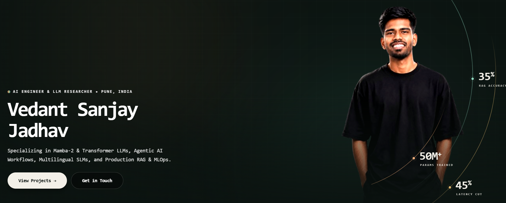

<div align="center">
  
</div>

<br/>

<div align="center">


</div>

<div align="center">

[](https://git.io/typing-svg)

</div>

<div align="center">

[](https://vedantjadhav-ai.vercel.app)
[](https://linkedin.com/in/vedantjadhav-ai)
[](https://github.com/VedantJadhav701)
[](https://orcid.org/0009-0002-6784-9511)
[](mailto:vedantjadhav1414@gmail.com)

</div>

---

## 🧠 About Me

I'm an **AI Systems Engineer and Machine Learning Researcher** focused on transitioning intelligent systems from theoretical research prototypes into optimized, production-grade deployments.

Currently pursuing my **B.Tech. in Artificial Intelligence & Machine Learning at Pimpri Chinchwad University, Pune** (2023–27).

My engineering and research interests lie at the intersection of:
- **Efficient Deep Learning** (Mamba/SSMs, KV-Cache Quantization, Knowledge Distillation)
- **Domain-Specific Language Models** (Medical, Educational, Financial & Telecom Reasoning)
- **Agentic Architectures** (Autonomous Workflows, Planner-Specialist Coordination, Multi-Agent Systems)
- **MLOps & Infrastructure** (Dockerized inference pipelines, statistical drift monitoring, sub-10ms serving)

```python
vedant = {
    "role": "AI Systems Engineer / ML Researcher",
    "education": "B.Tech. AI & ML (PCU, Pune)",
    "current_status": "AI Engineer Intern @ Tech Mahindra",
    "core_stack": ["Python", "PyTorch", "Hugging Face", "LangGraph", "FastAPI", "Docker", "Ollama"],
    "mission": "To design and deploy highly efficient, reliable, and localized AI models under constrained compute."
}
```

---

## 💼 Professional Experience

<table>
  <tr>
    <td width="20%" align="center">
      <br/>
      <br/>
      <sub><b>Jun 2026 — Present</b></sub><br/>
      <sub>Pune, India</sub>
    </td>
    <td>
      <h3>Young AI Engineer Intern — Indus Project</h3>
      <ul>
        <li>Leading key model experimentation, evaluation, and system design for Tech Mahindra's flagship <b>Indus</b> initiative.</li>
        <li>Training and deploying <b>Domain-Specific Language Models (DSLMs)</b> and <b>Vision-Language Models (VLMs)</b> under strict hardware constraints, utilizing <b>NVIDIA Nemotron 3.5</b> for LLM optimization.</li>
        <li>Architecting highly performant <b>RAG pipelines</b>, semantic retrieval models, and multi-agent workflows using PyTorch, LangGraph, FastAPI, and Ollama.</li>
      </ul>
    </td>
  </tr>
  <tr>
    <td width="20%" align="center">
      <br/>
      <br/>
      <sub><b>Oct 2025 — Apr 2026</b></sub><br/>
      <sub>Pune, India</sub>
    </td>
    <td>
      <h3>AI Engineer Intern</h3>
      <ul>
        <li>Built production Generative AI and RAG platforms, improving retrieval accuracy by <b>35%</b> and cutting latency by <b>45%</b> using hybrid chunking and reranking.</li>
        <li>Architected containerized LLM serving infrastructures using GitHub Actions, Docker Registry, and Kubernetes, implementing automated canary deployments (reducing deploy time to <b>&lt;10 minutes</b>).</li>
        <li>Optimized inference footprint on consumer-grade hardware through <b>KV-cache quantization</b> and structured drift monitoring.</li>
      </ul>
    </td>
  </tr>
</table>

---

## 🔬 Research & Publications

<table>
  <thead>
    <tr>
      <th width="15%">Type</th>
      <th width="65%">Paper Details</th>
      <th width="20%">Access</th>
    </tr>
  </thead>
  <tbody>
    <tr>
      <td><span align="center"><b>📄 Published</b></span></td>
      <td>
        <b>Ensemble and Hybrid ML Approaches for Renewable Energy Forecasting</b><br/>
        <i>IJEMS 2025 / AIP Publishing • Scopus Indexed • Best Paper Award at ICCTVB-25</i>
      </td>
      <td>
        <a href="https://doi.org/10.5281/zenodo.20040403">
          
        </a>
      </td>
    </tr>
    <tr>
      <td><span align="center"><b>🧪 Preprint</b></span></td>
      <td>
        <b>PhysicalMamba: State Space Models for Physical Planning and Robotic Task Execution</b><br/>
        <i>SSMs for high-dimensional sequence-to-action planning in physical agents.</i>
      </td>
      <td>
        <a href="https://doi.org/10.5281/zenodo.20807261">
          
        </a>
      </td>
    </tr>
    <tr>
      <td><span align="center"><b>🧪 Preprint</b></span></td>
      <td>
        <b>RecursiveMAS: A Recursive Multi-Agent Latent Coordination Framework for Embodied Task Optimization</b><br/>
        <i>Recursive multi-agent architectures for decentralized sequence optimization.</i>
      </td>
      <td>
        <a href="https://doi.org/10.5281/zenodo.20097645">
          
        </a>
      </td>
    </tr>
    <tr>
      <td><span align="center"><b>🔍 Review</b></span></td>
      <td>
        <b>Small Language Models for Clinical Reasoning and Medical Decision Alignment</b><br/>
        <i>Exploration of LLaMA, BioMistral, Med42v2, and Qwen for local medical alignment.</i>
      </td>
      <td>
        
      </td>
    </tr>
  </tbody>
</table>

<details>
  <summary><b>📚 Additional Research Preprints (Click to Expand)</b></summary>
  <br/>
  <ul>
    <li>
      <b>Finance-Aware Knowledge Distillation on Consumer Hardware: Achieving Reliable Financial Reasoning with 4GB VRAM</b><br/>
      Distilling large financial LLMs into small models fit for edge devices. 
      <a href="https://doi.org/10.5281/zenodo.19943872"><i>[DOI: 10.5281/zenodo.19943872]</i></a>
    </li>
    <li>
      <b>When Small Samples Mislead: Uncovering Performance Collapse in Financial Language Models Through Progressive Evaluation Scaling</b><br/>
      Addressing scaling evaluation bottlenecks in domain-specific financial language models.
      <a href="https://doi.org/10.5281/zenodo.19945937"><i>[DOI: 10.5281/zenodo.19945937]</i></a>
    </li>
    <li>
      <b>ML Models to Predict Levulinic Acid Production from Sugarcane Bagasse</b><br/>
      Scientific ML modeling of biomass conversion processes.
      <a href="https://doi.org/10.5281/zenodo.20041243"><i>[DOI: 10.5281/zenodo.20041243]</i></a>
    </li>
    <li>
      <b>Machine-Learning-Based Optimization of Decarbonisation Process of Magnesium Extraction from Dolomite</b><br/>
      Predictive modeling for decarbonization and industrial process optimization.
      <a href="https://doi.org/10.5281/zenodo.20040588"><i>[DOI: 10.5281/zenodo.20040588]</i></a>
    </li>
  </ul>
</details>

---

## 🚀 Featured Projects

<div align="center">

| Project Name | Scope & Core Contribution | Tech Stack | Deliverables |
| :--- | :--- | :--- | :--- |
| **[SparkAI-50M-A100](https://huggingface.co/vedantjadhav701/SparkAI-50M-Instruct)** | **Hybrid Mamba-Transformer LLM** trained from scratch on a single NVIDIA A100 (80GB). Blends Mamba-2 & Grouped Query Attention (GQA). | `PyTorch` `Mamba-2` `GQA` `HF` | [🤗 Model Repo](https://huggingface.co/vedantjadhav701/SparkAI-50M-Instruct) |
| **[Vidya LLM](https://github.com/VedantJadhav701)** | **1.7B Multilingual Educational LLM** fine-tuned for NCERT curricula. Operates across 11 Indian languages with 93.3% aggregate accuracy. | `Transformers` `LoRA` `Gradio` | [🌐 Live Demo](https://vidya-edu.vercel.app/) |
| **[AutoStack AI](https://autostack-ai.vercel.app/)** | **Autonomous MLOps Lifecycle Platform** that converts raw CSV datasets into deployable low-latency APIs with SHAP feature explainability. | `Scikit-learn` `FastAPI` `Docker` | [🌐 Live Demo](https://autostack-ai.vercel.app/) |
| **[WinFix OmniAgent](https://github.com/VedantJadhav701)** | **Evidence-Driven Windows Diagnostics Agent** executing safety-gated system fixes via planner-specialist TaskGraphs. | `Python` `LangGraph` `Ollama` | [💻 GitHub](https://github.com/VedantJadhav701) |
| **[TinyVLM](https://github.com/VedantJadhav701/TinyVLM)** | **Lightweight Vision-Language Model** aligning visual embeddings to compact text models for local captioning and VQA. | `PyTorch` `CLIP` `Transformers` | [💻 GitHub](https://github.com/VedantJadhav701/TinyVLM) |
| **[Demand Intelligence](https://github.com/VedantJadhav701/ai-demand-intelligence-platform)** | **End-to-End Demand Forecasting Engine** turning historical sales into actionable trends, time-series projections, and dashboard insights. | `Pandas` `Sklearn` `FastAPI` `Streamlit` | [🌐 Demo](https://demand-ai.vercel.app/) / [💻 GitHub](https://github.com/VedantJadhav701/ai-demand-intelligence-platform) |

</div>

<details>
  <summary><b>🛠️ Open-Source Utilities & Secondary Projects (Click to Expand)</b></summary>
  <br/>
  <ul>
    <li>
      <b>Developer Code Intelligence Agent</b>: Completely offline, local developer agent capable of bug localization, automated patch writing, and local validation. <i>(Stack: Python, Ollama, LangGraph)</i>
    </li>
    <li>
      <b>Antigravity Runtime</b>: AI execution runtime focusing on deterministic scheduling, self-healing architectures, and high-frequency audit logs. <i>(Stack: FastAPI, Docker, Python)</i>
    </li>
    <li>
      <b>Research Jarvis</b>: Autonomous agent monitoring arXiv and crawling PDFs, compiling precise research dossiers with semantic search index. <i>(Stack: FAISS, LangChain, Python)</i>
    </li>
    <li>
      <b>LLM KV Optimizer</b>: Research repository focusing on KV-cache size optimization to allow larger context windows during 4-bit local inference. <i>(Stack: PyTorch, CUDA)</i>
    </li>
    <li>
      <b>EcoGuard</b>: Waste classification and collection optimization backed by a full MLOps pipeline for training, testing, and container deployment. <i>(Stack: Docker, OpenCV, Python)</i>
    </li>
    <li>
      <b>Quant Risk Engine</b>: Regime-aware financial risk analyzer executing Monte Carlo simulations to detect portfolio anomalies. <i>(Stack: Streamlit, FastAPI)</i>
    </li>
  </ul>
</details>

---

## 🛠️ Technical Stack

<div align="center">

### 💻 Languages & Frameworks


### 🤖 LLMs & Agentic Ecosystem


### ⚙️ Backend, MLOps & Databases


</div>

---

## 🏆 Achievements & Certifications

<table width="100%">
  <tr>
    <td width="50%">
      <h4>🏆 Hackathons & Awards</h4>
      <ul>
        <li>🥇 <b>1st Place</b> — Code4Society Hackathon (2026)</li>
        <li>🥇 <b>1st Place</b> — Synquest IIT Delhi (2025)</li>
        <li>🥇 <b>1st Place</b> — CodeApex 24-Hour Hackathon, VIT (2025)</li>
        <li>🥉 <b>3rd Place</b> — National DevCraft Hackathon, IIT Indore (2025)</li>
        <li>🥉 <b>3rd Place</b> — National AI Hackathon, IIT Indore (2025)</li>
        <li>⭐ <b>Best Research Paper Award</b> — ICCTVB-25, Sanjay Ghodawat University (2025)</li>
        <li>🎯 <b>Top 25</b> — DecodeX, Mumbai (2025)</li>
      </ul>
    </td>
    <td width="50%">
      <h4>📜 Certifications</h4>
      <ul>
        <li>🎓 <b>Deep Learning Specialization</b><br/><i>DeepLearning.AI (Coursera) — 2025</i></li>
        <li>🎓 <b>Supervised Machine Learning</b><br/><i>Stanford University (Coursera) — 2025</i></li>
        <li>🎓 <b>Mathematics for ML & Data Science</b><br/><i>DeepLearning.AI (Coursera) — 2025</i></li>
      </ul>
    </td>
  </tr>
</table>

---

## 📊 Live GitHub Analytics

<div align="center">

### 🗃️ Contribution & Activity Metrics

<table width="100%">
  <tr>
    <td width="50%" align="center">
      
    </td>
    <td width="50%" align="center">
      
    </td>
  </tr>
  <tr>
    <td colspan="2" align="center">
      
    </td>
  </tr>
</table>

<br/>

### 🏆 GitHub Trophies


<br/><br/>

### 📈 Contribution Heatmap & Top Repositories

<table width="100%">
  <tr>
    <td width="60%" align="center">
      
    </td>
    <td width="40%" align="center">
      
    </td>
  </tr>
</table>

<br/>

### 💬 Random Dev Quote


<br/><br/>

<!-- Visitor Counter & Followers -->
<a href="https://visitcount.itsvg.in">
  
</a>
&nbsp;&nbsp;


</div>

---

<div align="center">


*Building AI systems that are efficient, reliable, and deployable.*<br/>
**[⬆ Back to top](#)**

</div>

